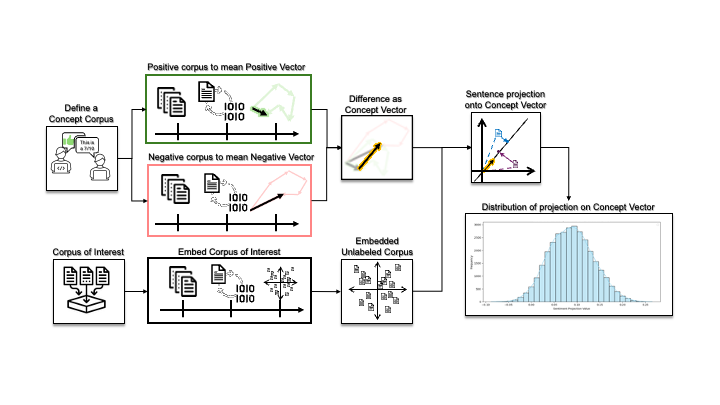
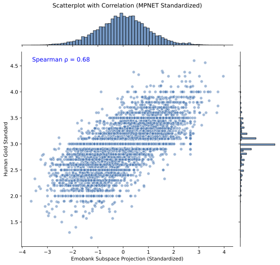
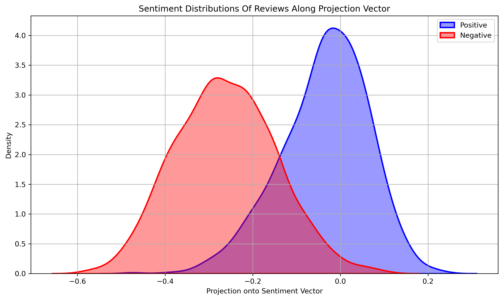

<h1 align="center">Continuous sentiment scores for literary and multilingual contexts</h1>
<p align="center">
    <a href="https://arxiv.org/abs/2508.14620">
        
    </a>
    <a href="https://huggingface.co/datasets/chcaa/fiction4sentiment">
        
    </a>
    <a href="https://github.com/JULIELab/EmoBank/blob/master/corpus/emobank.csv">
        
    </a>
</p>

## 📋 Table of Contents
- [Overview](#-overview)
- [Installation](#️-installation)
- [Usage](#-usage)
  - [Reproducing Paper Results](#-reproducing-paper-results)
- [Sanity-Check of the Sentiment Vector](#-sanity-check-of-the-sentiment-vector)
  - [Distribution Analysis](#-distribution-analysis)
  - [Word-Level Analysis](#-word-level-analysis)
- [License](#️-license)

## 🔍 Overview
A project developing a technique for extracting information from contextual sentence embeddings ([model="paraphrase-multilingual-mpnet-base-v2"](https://huggingface.co/sentence-transformers/paraphrase-multilingual-mpnet-base-v2)) by utilizing projection of embeddings onto a [concept vector](data/concept_vectors/vectors).

The repository contains the datasets used, the functions used to embbed the data, and a method for projecting new data onto the 'Concept Vector'.

The main pipeline of the project is visualised below.



## 🛠️ Installation
1. Clone the repository and navigate to it
```bash
git clone https://github.com/centre-for-humanities-computing/embedding-projection.git
cd embedding-projection
```

2. Create and activate virtual environment with uv
```bash
uv venv
source .venv/bin/activate
```

3. Install dependencies from pyproject.toml
```bash
python -m venv venv
source venv/bin/activate
pip install -e .
```
**Requirements:**
Dependencies needed to run main.py can be found in the [pyproject.toml](pyproject.toml). 

## 🚀 Usage
### 📊 Reproducing Paper Results
Run main.py to reproduce the plots and results used in the paper:

```bash
# Make sure your virtual environment is activated
source .venv/bin/activate

# Run the main script
python main.py

# The script will:
# 1. Load and preprocess the datasets
# 2. Create embeddings using MPNET
# 3. Generate concept vectors
# 4. Project test data onto concept vectors
# 5. Create plots in the plots/ directory
```

## 🧪 Sanity-Check of the Sentiment Vector
It seems that there is a rather strong correlation between average human anotator and the projection method!
This is seen in the scatterplot below, visualising the correlation between predictions and annotators for the EmoBank dataset (which is left out of training dataset):




### 📈 Distribution Analysis
The projection of binary-classified IMDB reviews onto our Sentiment Vector shows clear separation between positive and negative sentiments:



### 🔤 Word-Level Analysis
To validate our approach, we projected individual words from the corpus onto the Sentiment Vector. This method, inspired by [S3 - Semantic Signal Separation](https://arxiv.org/abs/2406.09556). The script for doing this is not included in the repo:


#### ⬆️ Highest Projection Score
```
pleasure    anytime     admired     admire      fabulous
classical   beloved     romantic    anthologies  lovely
```

#### ⬇️ Lowest Projection Score
```
worse       terrible    sucked      horrible    worst
bad         rotten      unacceptable stupidity   awful
```
*⚠️ Note: it seems that the vector might be correlated with the romantic literature period (H.C.Andersen), i.e. "anthologies, classical, romantic". This might be a byproduct of fairytales having a high density of positive semantics, thus being overrepresented in the training set.*

## ⚖️ License
embedding-projection is available under the MIT license. See the LICENSE file for more info.
